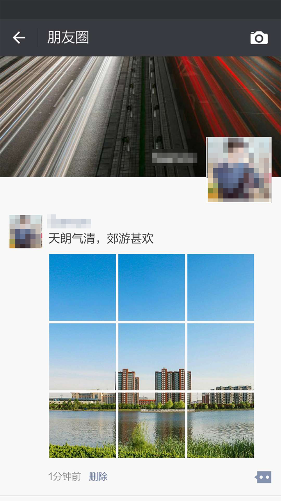

# 朋友圈九宫格图片切割神器

 [GitHub 项目地址](https://github.com/xushanmeng/WechatImageSlicer)

## 功能简介

>帮你把图片切割成九宫格的样式，并支持快速发送到朋友圈

* 支持丰富的切割类型，包括两图、三图、四图、六图、九图等不同的切割类型
* 支持朋友圈效果预览
* 支持快速发送到朋友圈

    


## 编译环境
1. JAVA，最低版本为8.0，[官网下载](http://www.oracle.com/technetwork/java/javase/downloads/index.html)
2. Android Studio，[官网下载(需要翻墙)](https://developer.android.com)，或者到[这里](http://www.android-studio.org)下载
3. Android手机或者模拟器，用来运行APK

## 使用方法

>有Android开发工具的同学可以直接导入工程，便于代码调试，不会Android开发的同学可以直接用Android手机安装[com.samon.wechatimageslicer.apk](artifact/com.samon.wechatimageslicer.apk)即可

下面是使用步骤：

1. 打开APP，点击`选择图片`

    
   
2. 选择你想要切割的图片个数，这里以9图为例

    
  
3. 选择你想切割的图片，并调整显示区域，调整好之后点击`完成`

    

4. 预览朋友圈效果，如果效果满意，点击`导出切片`，如果不满意，可以重新选择图片

    

5. 点击下方的保存路径，可以直接跳转到朋友圈发送界面

    

6. 在朋友圈编辑好文字后，可以直接点击`发送`

    

7. 发送到朋友圈之后如下图

    
    
## 工程结构

```目录结构
.
├── Samples                     #一些示例图片
├── app                         #工程主模组
│   ├── AndroidManifest.xml     #清单文件
│   ├── build.gradle            #主模组编译脚本
│   ├── res                     #工程资源文件目录
│   └── src                     #工程java代码目录
├── artifact                    #最终生成的APK所在目录
├── build.gradle                #编译脚本
└── settings.gradle             #编译配置文件

```
